# RapidReach User Technical Manual

## Table of Contents

1. [Introduction](#introduction)
2. [Getting Started](#getting-started)
   - [System Requirements](#system-requirements)
   - [Installation](#installation)
   - [Logging In](#logging-in)
3. [User Roles](#user-roles)
   - [Customer](#customer)
   - [Warehouse Worker](#warehouse-worker)
   - [Driver](#driver)
   - [Administrator](#administrator)
4. [Dashboard Overview](#dashboard-overview)
5. [Customer Guide](#customer-guide)
   - [Browsing Products](#browsing-products)
   - [Placing Orders](#placing-orders)
   - [Tracking Deliveries](#tracking-deliveries)
   - [Managing Profile](#managing-profile)
6. [Warehouse Worker Guide](#warehouse-worker-guide)
   - [Product Management](#product-management)
   - [Order Processing](#order-processing)
   - [Inventory Management](#inventory-management)
7. [Driver Guide](#driver-guide)
   - [Viewing Available Orders](#viewing-available-orders)
   - [Claiming Orders](#claiming-orders)
   - [Updating Delivery Status](#updating-delivery-status)
   - [Navigation &amp; Route Planning](#navigation--route-planning)
8. [Administrator Guide](#administrator-guide)
   - [User Management](#user-management)
   - [System Configuration](#system-configuration)
   - [Reports &amp; Analytics](#reports--analytics)
9. [Troubleshooting](#troubleshooting)
   - [Common Issues](#common-issues)
   - [Error Messages](#error-messages)
   - [Contact Support](#contact-support)
10. [FAQ](#faq)

## Introduction

Welcome to RapidReach, a comprehensive order management and delivery platform designed to streamline your business operations. This technical manual provides detailed instructions on how to use the system effectively.

RapidReach connects customers, warehouse workers, and delivery drivers through an intuitive interface that enables seamless product ordering, inventory management, and delivery tracking.

## Getting Started

### System Requirements

To use RapidReach effectively, ensure your system meets the following requirements:

- **Web Browser**: Chrome (v88+), Firefox (v85+), Safari (v14+), or Edge (v88+)
- **Internet Connection**: Broadband connection with minimum 5 Mbps download speed
- **Device**: Desktop, laptop, tablet, or smartphone
- **Operating System**: Windows 10+, macOS 10.14+, iOS 13+, or Android 9+

### Installation

RapidReach is a web-based application that doesn't require installation. However, for optimal mobile experience, you can add the web app to your home screen:

**For iOS devices:**

1. Open RapidReach in Safari
2. Tap the Share button
3. Select "Add to Home Screen"

**For Android devices:**

1. Open RapidReach in Chrome
2. Tap the menu button (three dots)
3. Select "Add to Home Screen"

### Logging In

To access RapidReach:

1. Open your web browser and navigate to [https://rapidreach.example.com](https://rapidreach.example.com)
2. Click on "Login" in the top-right corner
3. Enter your email address and password
4. Click "Sign In"

If you've forgotten your password:

1. Click "Forgot Password?" on the login screen
2. Enter your email address
3. Follow the instructions sent to your email to reset your password

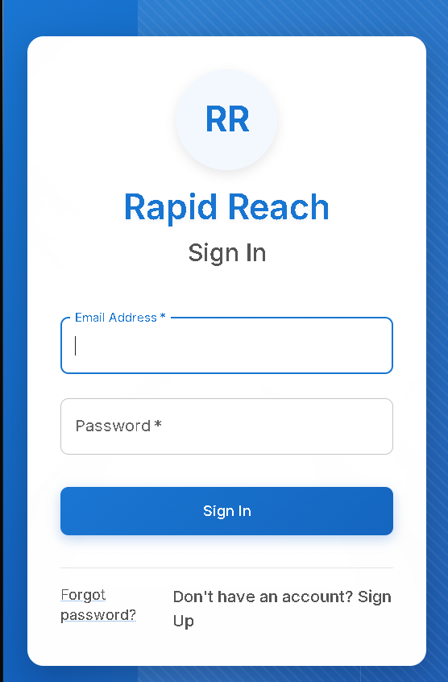

## User Roles

RapidReach has four primary user roles, each with specific functionalities:

### Customer

- Browse and purchase products
- Track order status and delivery
- Manage personal profile and addresses
- View order history

### Warehouse Worker

- Manage product inventory
- Process incoming orders
- Prepare orders for delivery
- Update product information

### Driver

- View available orders for delivery
- Claim orders for delivery
- Update delivery status
- Navigate to delivery locations

### Administrator

- Manage user accounts
- Configure system settings
- View comprehensive reports
- Manage warehouse and driver assignments

## Customer Guide

### Browsing Products

To browse products:

1. Click on "Products" in the main navigation menu
2. Use the search bar to find specific products
3. Filter products by category using the dropdown menu
4. Sort products by price, popularity, or newest additions
5. Click on a product to view detailed information

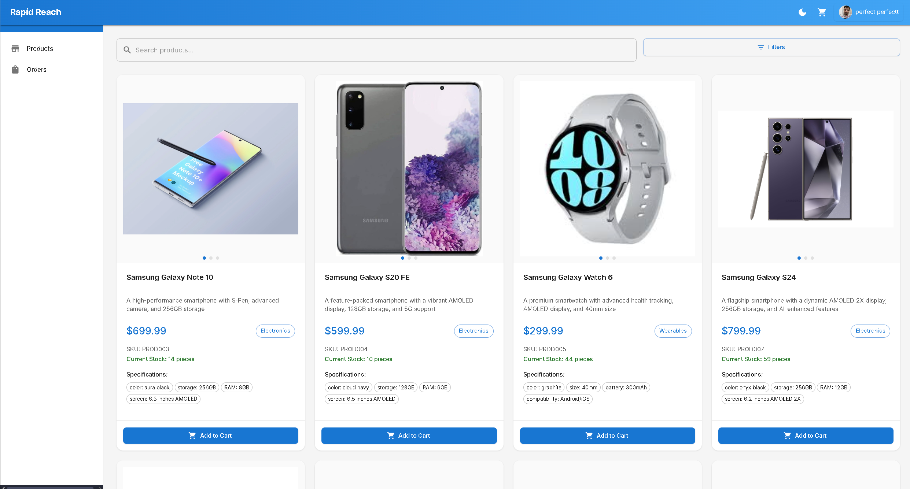

### Placing Orders

To place an order:

1. Find the product you want to purchase
2. Click "Add to Cart"
3. Continue shopping or click on the cart icon to proceed to checkout
4. Review your order items
5. Select or add a delivery address
6. Click "Place Order" to complete your purchase

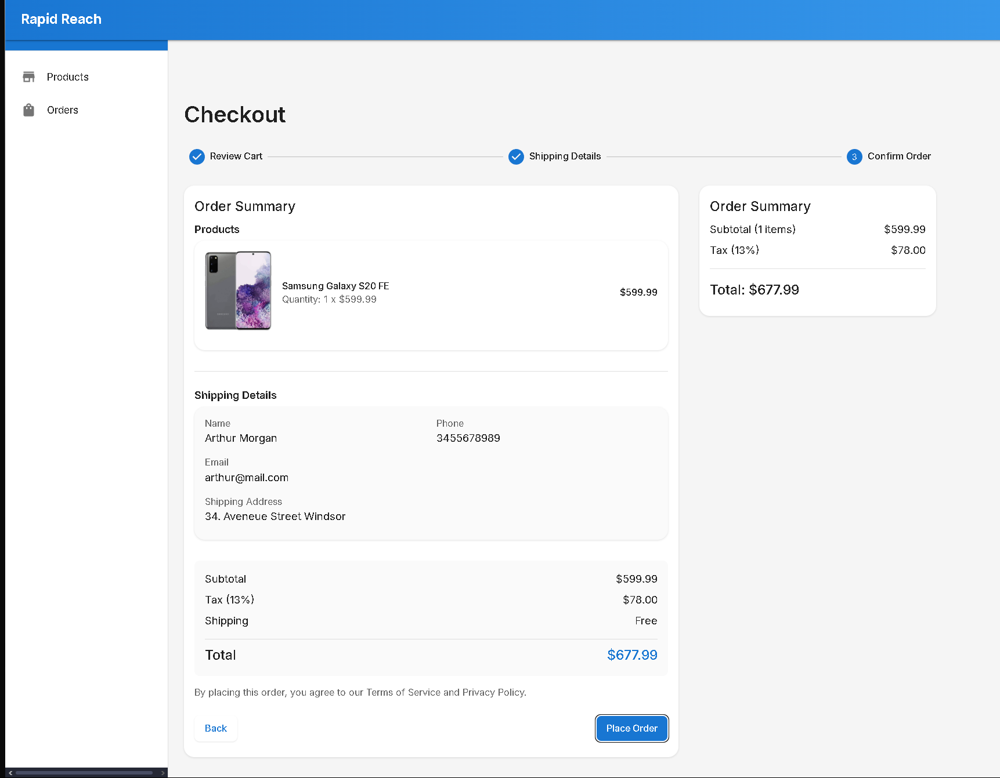

### Tracking Deliveries

To track your order:

1. Click on "Orders" in the navigation menu
2. Select the order you want to track
3. View the current status of your order
4. For orders in transit, you may see the real-time location of your delivery

Order statuses include:

- Pending: Order received but not yet processed
- Prepared: Order has been prepared and is ready for pickup
- Out for Delivery: Order is with a driver and on its way
- Delivered: Order has been successfully delivered
- Not Delivered: Delivery was attempted but unsuccessful

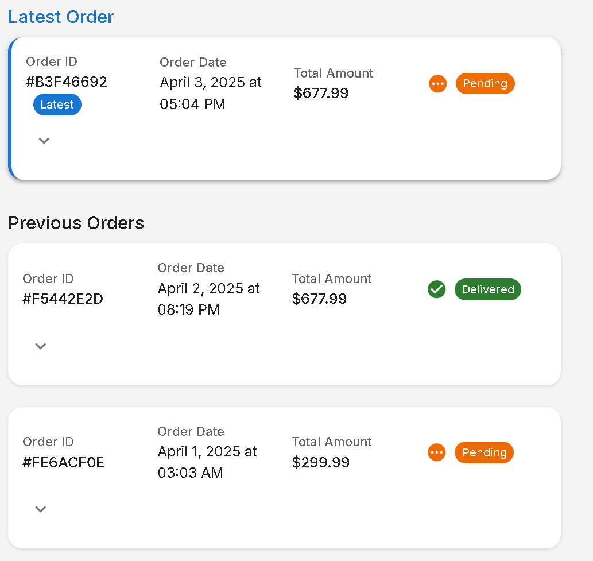

### Managing Profile

To update your profile information:

1. Click on your profile icon in the top-right corner
2. Select "Profile" from the dropdown menu
3. Update your personal information, including:
   - Profile picture
   - Contact information
   - Password
   - Saved addresses
4. Click "Save Changes" when finished

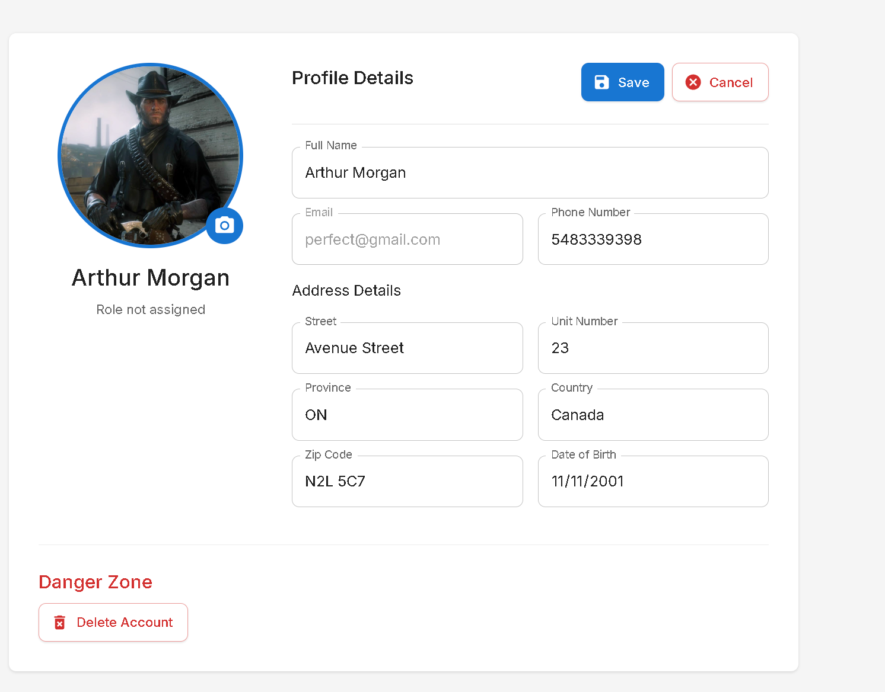

## Warehouse Worker Guide

### Product Management

As a warehouse worker, you can manage products through the Product Management interface:

1. Navigate to "Products" in the sidebar menu
2. View existing products in a tabular format
3. To add a new product:
   - Click "Add Product"
   - Fill in product details (name, description, price, etc.)
   - Add product specifications as key-value pairs
   - Upload product images and an optional video
   - Set the warehouse code
   - Click "Save"
4. To edit an existing product:
   - Click the "Edit" icon next to the product
   - Update product information as needed
   - Click "Save"
5. To delete a product:
   - Click the "Delete" icon next to the product
   - Confirm the deletion when prompted

**Note:** When adding product specifications, provide clear and concise information that helps customers understand the product features.

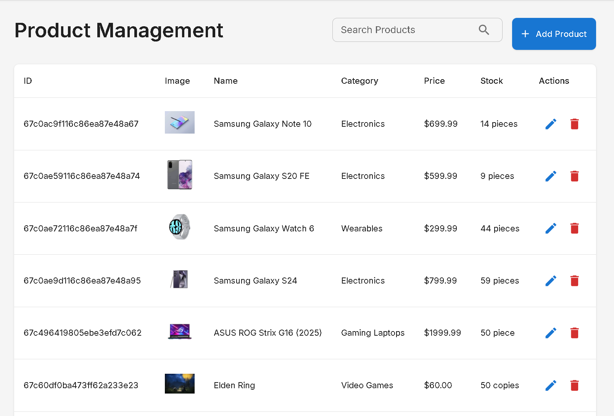

### Order Processing

To process customer orders:

1. Navigate to "Orders" in the sidebar
2. View pending orders in the "Pending" tab
3. Select an order to view details
4. Verify the items in the order
5. Click "Mark Prepared" when the order is ready for pickup
6. The order will move to the "Ready for Pickup" tab

**Tip:** Process orders in the sequence they were received to ensure fair delivery times.

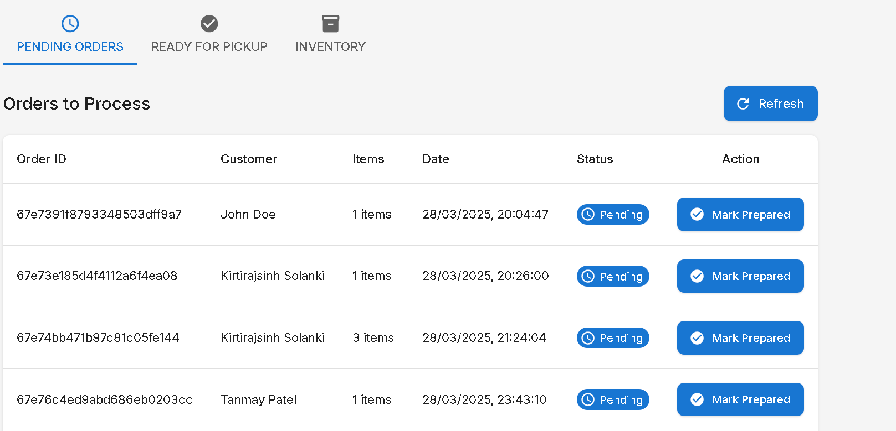

## Driver Guide

### Viewing Available Orders

As a driver, you can view orders that are ready for delivery:

1. Navigate to "Available Orders" in the sidebar
2. Browse the list of orders ready for pickup
3. View order details, including:
   - Pickup location
   - Delivery address
   - Items in the order
   - Customer contact information

### Claiming Orders

To claim an order for delivery:

1. Find an order you want to deliver
2. Click "Claim Order"
3. The order status will update to "Out for Delivery"
4. The order will move to your "My Deliveries" list

**Note:** Once you claim an order, you are responsible for its delivery. Only claim orders that you can deliver in a timely manner.

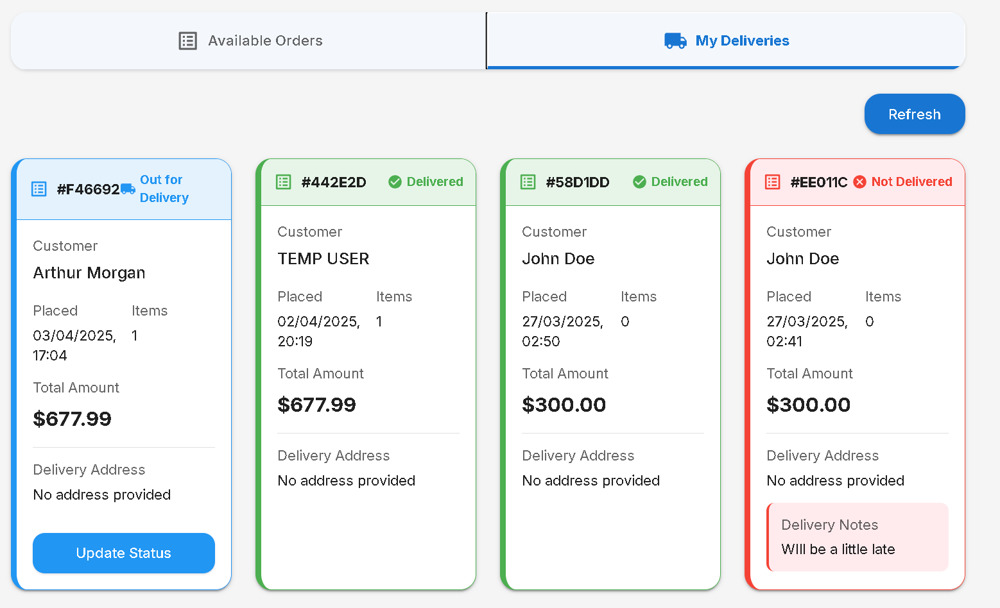

### Updating Delivery Status

To update the status of an order during delivery:

1. Navigate to "My Deliveries" in the sidebar
2. Select the order you are currently delivering
3. Click "Update Delivery Status"
4. Select the appropriate status:
   - Out for Delivery (default when claimed)
   - Delivered (when successfully delivered to the customer)
   - Not Delivered (if delivery attempt was unsuccessful)
5. Add notes if necessary (especially for unsuccessful deliveries)
6. Click "Save" to update the status

**Important:** For "Not Delivered" status, always provide a detailed reason to help customer service follow up.

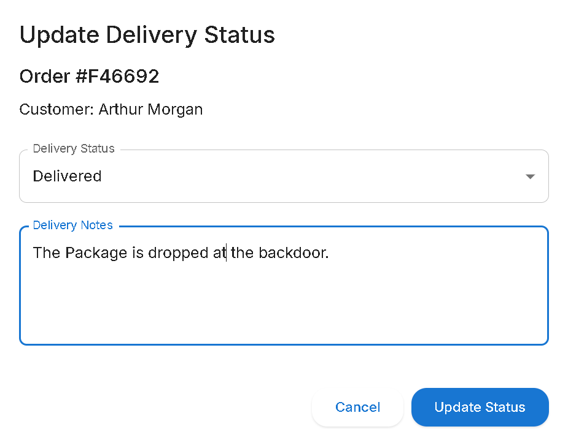

## Administrator Guide

### User Management

As an administrator, you can manage user accounts:

1. Navigate to "User Management" in the sidebar
2. View all users in the system
3. Create new user accounts
4. Edit existing user information
5. Assign or change user roles
6. Disable or enable user accounts

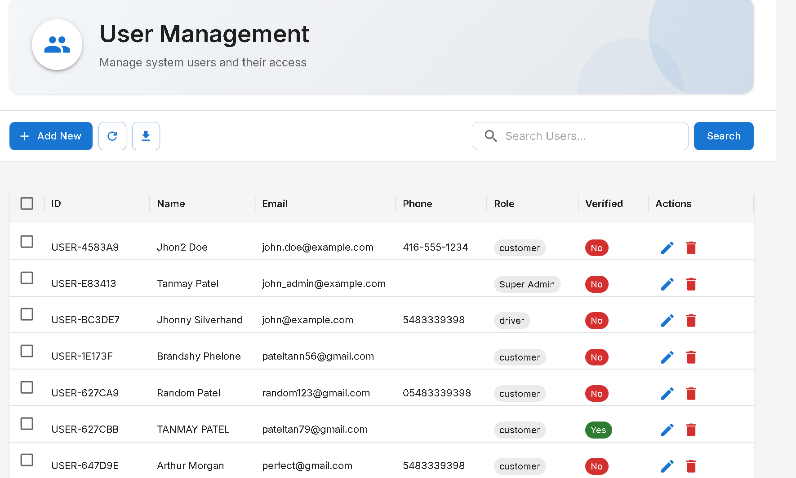

### Reports & Analytics

To access reports and analytics:

1. Navigate to "Reports" in the sidebar
2. Select available Monthly report :
3. Set date ranges and filters as needed
4. View reports as charts or export as PDF

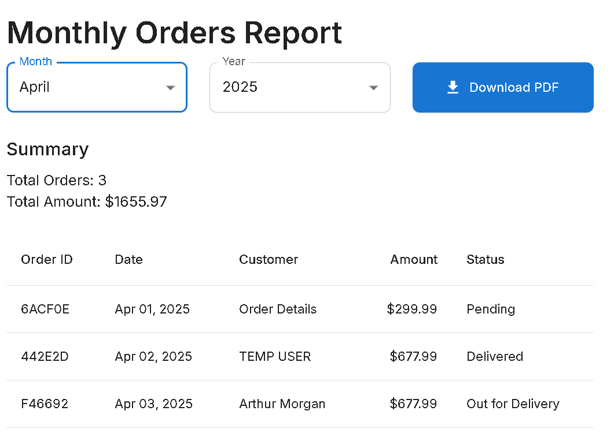

## Troubleshooting

### Common Issues

#### Login Problems

- **Issue**: Cannot log in despite correct credentials
- **Solution**: Clear browser cookies and cache, then try again

#### Slow Application Performance

- **Issue**: Application is loading slowly
- **Solution**: Check your internet connection speed
- **Alternative**: Try using a different browser or device

#### Image Upload Failures

- **Issue**: Cannot upload product images
- **Solution**: Ensure images are under 2MB in size and in JPG, PNG, or WebP format
- **Alternative**: Resize the image using an image editing tool before uploading

### Error Messages

| Error Code | Description       | Resolution                                   |
| ---------- | ----------------- | -------------------------------------------- |
| E1001      | Session expired   | Log in again to continue                     |
| E1002      | Connection error  | Check your internet connection and try again |
| E1003      | Permission denied | Contact your administrator for access        |
| E1004      | File too large    | Reduce file size and try again               |
| E1005      | Invalid format    | Ensure the file is in a supported format     |

## FAQ

**Q: Can I change my user role?**
A: No, user roles can only be changed by system administrators. Contact your administrator if you need a role change.

**Q: How do I update my profile picture?**
A: Go to Profile settings, click on the profile picture, select a new image (under 2MB), and save changes.

**Q: What happens if I claim an order but cannot deliver it?**
A: Contact your supervisor immediately. They can reassign the order to another driver.

**Q: Why can't I see certain products as a customer?**
A: Products might be out of stock, discontinued, or not available in your region.

**Q: Can I use RapidReach on my mobile device?**
A: Yes, RapidReach is fully responsive and works on smartphones and tablets. For the best experience, add it to your home screen.

---

Thank you for using RapidReach. This manual will be updated regularly as new features are added. For the latest version, please visit our documentation portal at [docs.rapidreach.example.com](https://docs.rapidreach.example.com).

Last updated: June 2024
